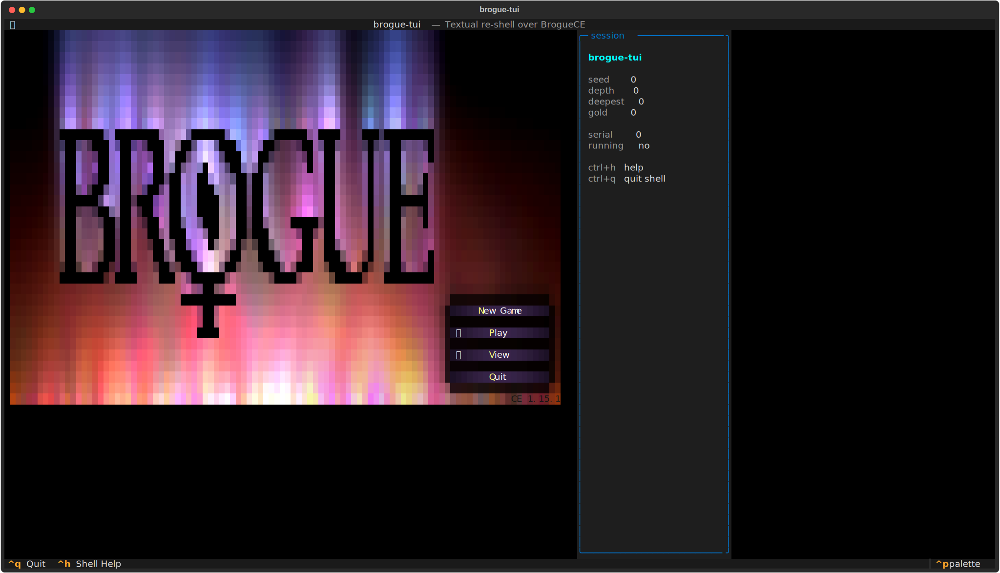
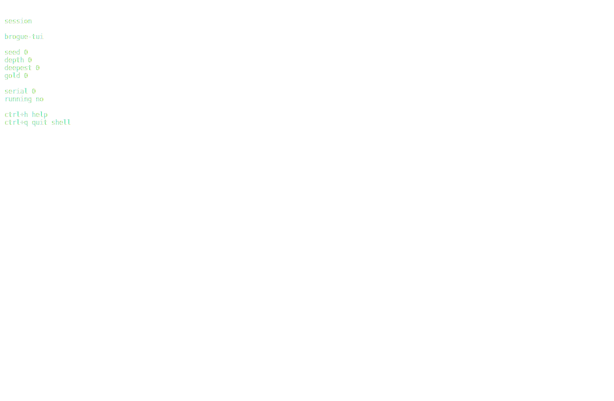

# brogue-tui
Descend. Dare. Die. Again.




## About
Twenty-six levels of hand-crafted dungeon beckon the brave. BrogueCE — the most elegant roguelike in the canon — now multi-paned in Textual, mouse-aware, themeable, with a REST agent API and every original keystroke intact. Flame, frost, protection, confusion, the Amulet of Yendor. The underworld is patient. The pixel-dragon waits on 26.

## Screenshots


## Install & Run
```bash
git clone https://github.com/akakabrian/brogue-tui
cd brogue-tui
make
make run
```

## Controls
<Add controls info from code or existing README>

## Testing
```bash
make test       # QA harness
make playtest   # scripted critical-path run
make perf       # performance baseline
```

## License
GPL-3.0

## Built with
- [Textual](https://textual.textualize.io/) — the TUI framework
- [tui-game-build](https://github.com/akakabrian/tui-foundry) — shared build process
